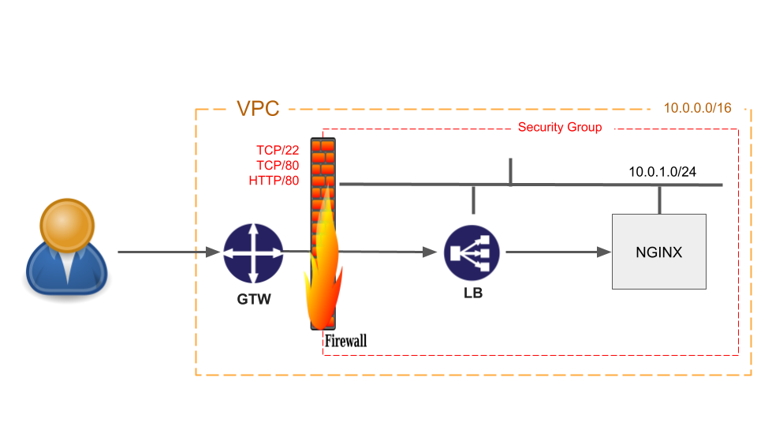
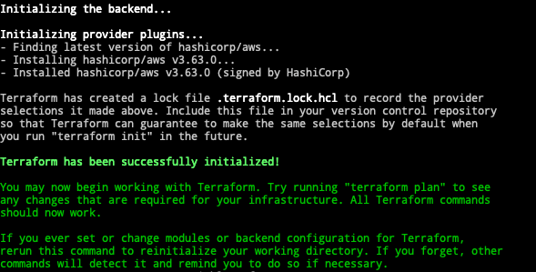
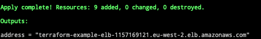
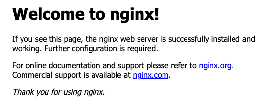
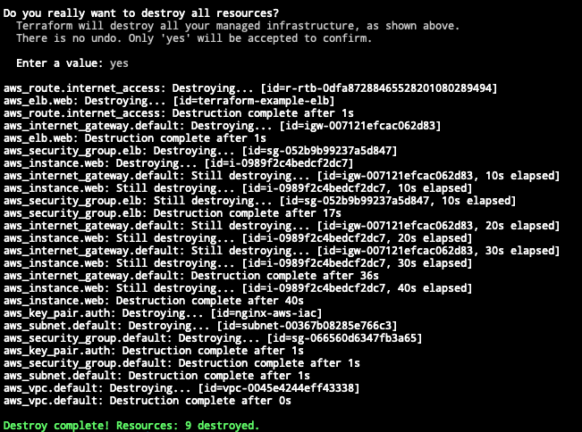

# IaC: Provisioning a nginx server

This is a short exercise to get you used to provisioning infrastrucure using an IaC tool. We have chosen *Terraform* for this exercise but there are many other tools available out there.  
The code is all in this README. However, all examples can be found in the [example](example) directory.

## Setup
- Have Terraform installed on your local machine
- Have your AWS credentials configured as described [here](https://registry.terraform.io/providers/hashicorp/aws/latest/docs)
- Create a directory and go in there - `mkdir nginx-aws && cd nginx-aws-iac`
- Create a sub-directory for the keys - `mkdir keys`
- Create a pair of keys to be used - `ssh-keygen -b 4096 -f ./keys/nginx-aws-iac`
- Add the key to the ssh agent - `ssh-add ./keys/nginx-aws-iac`

## Overview  

This is the environment we are going to provision on AWS using Terraform.  
  


It is made up of:
- VPC
- Internet Gateway
- Security Group
- Subnet
- Load Balancer
- VM running nginx server
  
## Terraform configuration  
 
1. Create a file named `variables.tf` with the content below to define the variables to be used by our Terraform code:
    ```
    variable "public_key_path" {
        description = <<DESCRIPTION
    Path to the SSH public key to be used for authentication.
    Ensure this keypair is added to your local SSH agent so provisioners can
    connect.

    Example: ~/.ssh/terraform.pub
    DESCRIPTION
    }

    variable "key_name" {
        description = "Desired name of AWS key pair"
    }

    variable "aws_region" {
        description = "AWS region to launch servers."
    }

    # Ubuntu Precise 20.04 LTS (x64)
    variable "aws_amis" {
        default = {
            eu-west-2 = "ami-0c109f697ab7fc6f4"
            eu-west-1 = "ami-0644c2c26649aac62"
            us-east-1 = "ami-036490d46656c4818"
            us-east-2 = "ami-044696ab785e77725"
            us-west-1 = "ami-09bedd705318020ae"
            us-west-2 = "ami-0964546d3da97e3ab"
        }
    }
    ```

1. Create a file named `terraform.tfvars` with the content below to set values of the variables:  
    ```
    key_name        = "nginx-aws-iac"
    public_key_path = "./keys/nginx-aws-iac.pub"
    aws_region      = "eu-west-2"
    ```
    The content above defines the SSH key name and the path to the SSH public key file, as well as the AWS region to be used. Possible options are:
    - eu-west-2
    - eu-west-1
    - us-east-1
    - us-east-2
    - us-west-1
    - us-west-2  
  
1. Create a file named `outputs.tf` with the content below to instruct Terraform to print out the DNS name of the load balancer created. We are going to use this name to access the nginx server:  
    ```
    output "address" {
        value = aws_elb.web.dns_name
    }
    ``` 
  
1. We are now going to create a file named `main.tf` containing the code defining our whole new environment!  
    The first section just declares the bare minimum *Terraform* version to be used:  
    ```
    terraform {
        required_version = ">= 0.12"
    }
    ``` 
    This section declares the *Terraform provider*,* AWS, and the region to be used:  
    ```
    provider "aws" {
        region = var.aws_region
    }
    ``` 
    This section defines our VPC:  
    ```
    # Create a VPC to launch our instances into
    resource "aws_vpc" "default" {
        cidr_block = "10.0.0.0/16"
    }
    ``` 
    This section defines our internet gateway:  
    ```
    # Create an internet gateway to give our subnet access to the outside world
    resource "aws_internet_gateway" "default" {
        vpc_id = aws_vpc.default.id
    }

    # Grant the VPC internet access on its main route table
    resource "aws_route" "internet_access" {
        route_table_id         = aws_vpc.default.main_route_table_id
        destination_cidr_block = "0.0.0.0/0"
        gateway_id             = aws_internet_gateway.default.id
    }
    ``` 
    This section defines our subnet:  
    ```
    # Create a subnet to launch our instances into
    resource "aws_subnet" "default" {
        vpc_id                  = aws_vpc.default.id
        cidr_block              = "10.0.1.0/24"
        map_public_ip_on_launch = true
    }
    ``` 
    This section defines our security group and access rules:  
    ```
    # A security group for the ELB so it is accessible via the web
    resource "aws_security_group" "elb" {
        name        = "terraform_example_elb"
        description = "Used in the terraform"
        vpc_id      = aws_vpc.default.id

        # HTTP access from anywhere
        ingress {
            from_port   = 80
            to_port     = 80
            protocol    = "tcp"
            cidr_blocks = ["0.0.0.0/0"]
        }

        # outbound internet access
        egress {
            from_port   = 0
            to_port     = 0
            protocol    = "-1"
            cidr_blocks = ["0.0.0.0/0"]
        }
    }

    # Our default security group to access
    # the instances over SSH and HTTP
    resource "aws_security_group" "default" {
        name        = "terraform_example"
        description = "Used in the terraform"
        vpc_id      = aws_vpc.default.id

        # SSH access from anywhere
        ingress {
            from_port   = 22
            to_port     = 22
            protocol    = "tcp"
            cidr_blocks = ["0.0.0.0/0"]
        }

        # HTTP access from the VPC
        ingress {
            from_port   = 80
            to_port     = 80
            protocol    = "tcp"
            cidr_blocks = ["10.0.0.0/16"]
        }

        # outbound internet access
        egress {
            from_port   = 0
            to_port     = 0
            protocol    = "-1"
            cidr_blocks = ["0.0.0.0/0"]
        }
    }
    ``` 
    This section defines our load balancer:  
    ```
    resource "aws_elb" "web" {
        name = "terraform-example-elb"

        subnets         = [aws_subnet.default.id]
        security_groups = [aws_security_group.elb.id]
        instances       = [aws_instance.web.id]

        listener {
            instance_port     = 80
            instance_protocol = "http"
            lb_port           = 80
            lb_protocol       = "http"
        }
    }
    ``` 
    And finally our nginx server and its SSH keys:  
    ```
    resource "aws_key_pair" "auth" {
        key_name   = var.key_name
        public_key = file(var.public_key_path)
    }

    resource "aws_instance" "web" {
        # The connection block tells our provisioner how to
        # communicate with the resource (instance)
        connection {
            type = "ssh"
            # The default username for our AMI
            user = "ubuntu"
            host = self.public_ip
            # The connection will use the local SSH agent for authentication.
        }

        instance_type = "t2.micro"

        # Lookup the correct AMI based on the region
        # we specified
        ami = var.aws_amis[var.aws_region]

        # The name of our SSH keypair we created above.
        key_name = aws_key_pair.auth.id

        # Our Security group to allow HTTP and SSH access
        vpc_security_group_ids = [aws_security_group.default.id]

        # We're going to launch into the same subnet as our ELB. In a production
        # environment it's more common to have a separate private subnet for
        # backend instances.
        subnet_id = aws_subnet.default.id

        # We run a remote provisioner on the instance after creating it.
        # In this case, we just install nginx and start it. By default,
        # this should be on port 80
        provisioner "remote-exec" {
            inline = [
            "sudo apt-get -y update",
            "sudo apt-get -y install nginx",
            "sudo service nginx start",
            ]
        }
    }
    ```  
  
## It's showtime!
  
We are now going to provision our new environment.  
  
1. Make sure your console is open on the `nginx-aws` directory that we created during the *Setup* above
1. Run the command `terraform init`  
    If successful, the output should be like below:  
      
      
1. Run the command `terraform apply`  
    Confirm the execution typing `yes` followed by ENTER.  
    The whole execution will take some time and if successful the output should end with a message like below:  
      
      
1. Open in your browser the URL showed on the last line output to see the nginx server home page:  
      
       

## Cleaning up
  
It is always a good practice to deprovision the environments that are not required anymore. IaC help us with that as well.  
  
1. Run the command `terraform destroy`  
    Confirm the execution typing `yes` followed by ENTER.  
    If successful, the output should be like below:  
      
   
We have concluded this exercise. Congratulations!!!  
  
Welcome to the **Infrastructure as Code** family. 